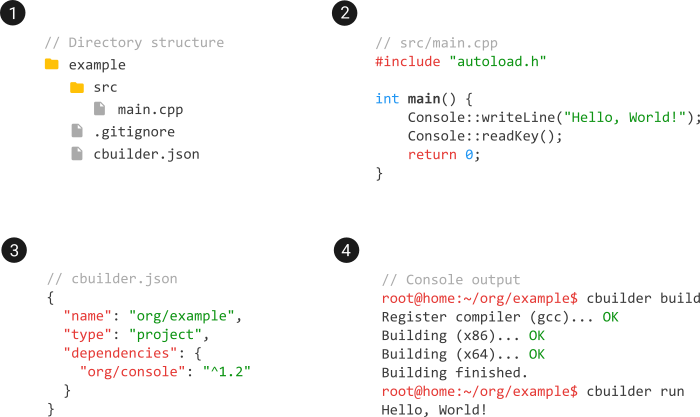

# Package Manager for C++

The aim of this project is to create the tool like [composer](https://getcomposer.org/) or [npm](https://www.npmjs.com/), but for the c++. The image below shows basic usage example.

## Contributing

Thank you for considering contributing! If you would like to fix a bug or propose a new feature, you can submit a Pull Request.

## License

The library is licensed under the [MIT license](https://opensource.org/licenses/MIT).
